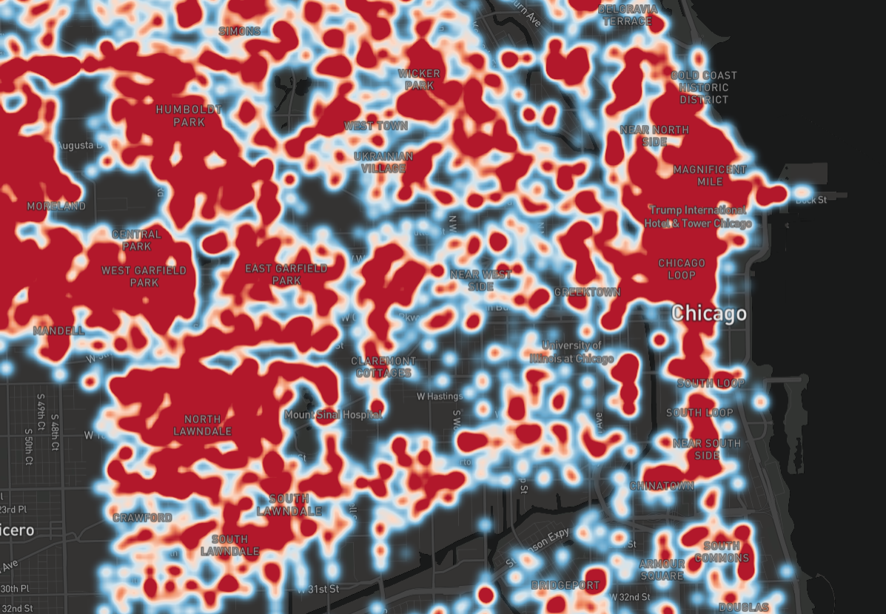

# Heatmap
## Heatmap Project

This map is a heatmap of crime data from Chicago. A map of Chicago with a dark style uses GeoJSON data to add an overlay of a heatmap. The map can appear differently by changing the array numbers in the heatmap-weight and/or heatmap-intensity properties.  
To run this on your machine, you’ll need all of these files and you'll need to load the .html file onto your browser (NOTE: API keys from Mapbox are currently not present in code. They are needed to run the code).  
Additional functionality that would be helpful to a user for future iterations would be to include an animated crime comparison over time.  
MIT License  
Copyright (c) 2023 Yvette Watson  
Permission is hereby granted, free of charge, to any person obtaining a copy of this software and associated documentation files (the "Software"), to deal in the Software without restriction, including without limitation the rights to use, copy, modify, merge, publish, distribute, sublicense, and/or sell copies of the Software, and to permit persons to whom the Software is furnished to do so, subject to the following conditions:
The above copyright notice and this permission notice shall be included in all copies or substantial portions of the Software.  
THE SOFTWARE IS PROVIDED "AS IS", WITHOUT WARRANTY OF ANY KIND, EXPRESS OR IMPLIED, INCLUDING BUT NOT LIMITED TO THE WARRANTIES OF MERCHANTABILITY, FITNESS FOR A PARTICULAR PURPOSE AND NONINFRINGEMENT. IN NO EVENT SHALL THE AUTHORS OR COPYRIGHT HOLDERS BE LIABLE FOR ANY CLAIM, DAMAGES OR OTHER LIABILITY, WHETHER IN AN ACTION OF CONTRACT, TORT OR OTHERWISE, ARISING FROM, OUT OF OR IN CONNECTION WITH THE SOFTWARE OR THE USE OR OTHER DEALINGS IN THE SOFTWARE.
